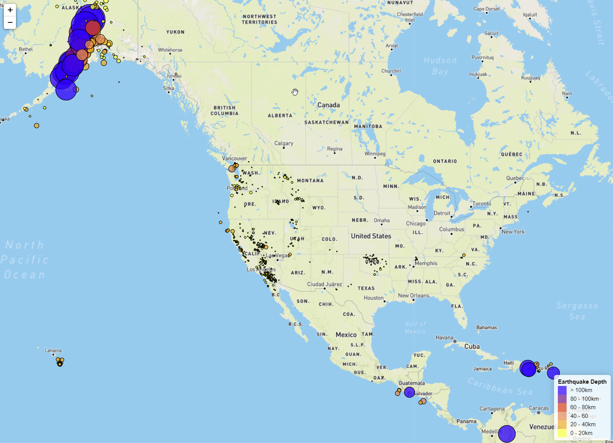

# leaflet-challenge

Using up to the minute USGC earthquake data, seismic activity for the last last 7 24 hour periods are displyed on a worldwide map. The eartquakes are displayed as circles indicating the size of the earthquake, remember the Richter scale is logarithmic, and the colours of the cirlces indicating that the depth, km, of the earthquake - the darker the colour, the deeeper the earthquake - refere to map legend. 

The data was retreived in GeoJson format from [this](https://earthquake.usgs.gov/earthquakes/feed/v1.0/geojson.php) site. 

Below is an example of the webpage - the ground was a shaking in Alaska at when this image was created! 

To launch the webpage, all you have to do is launch the index.html file. Move around a little to see where its been shaking recently!

# How to?
Please navigate directly to [here](https://github.com/Conor134/leaflet-challenge).
